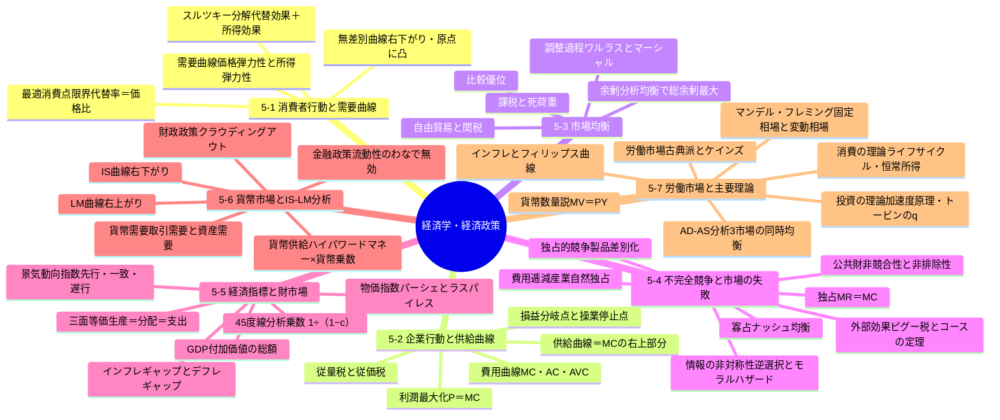
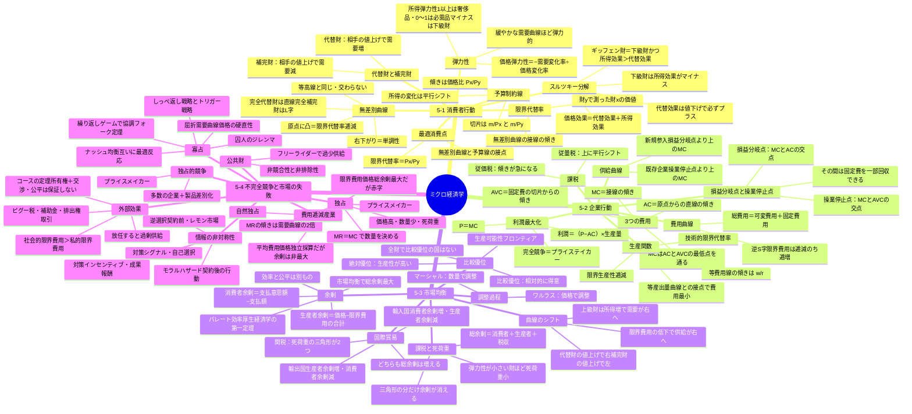
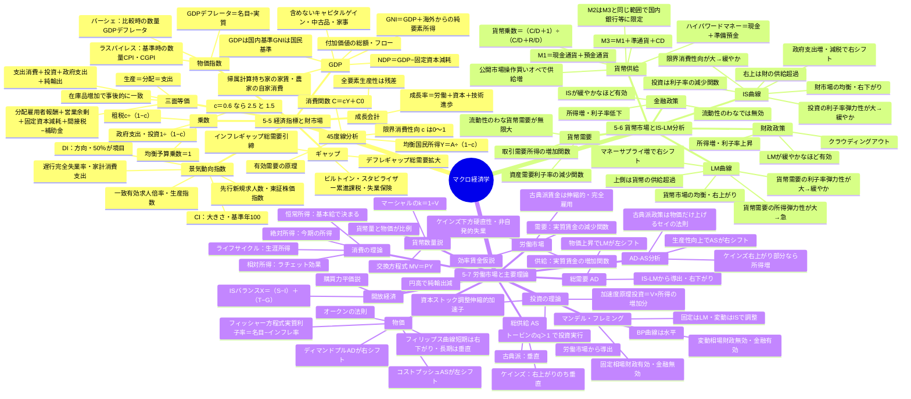

# 経済学・経済政策 全体マインドマップ

[全体](#all)[ミクロ詳細（5-1〜5-4）](#micro)[マクロ詳細（5-5〜5-7）](#macro)

## 全体図

```mermaid
mindmap
  root((経済学・経済政策))
    5-1 消費者行動と需要曲線
      無差別曲線右下がり・原点に凸
      最適消費点限界代替率＝価格比
      需要曲線価格弾力性と所得弾力性
      スルツキー分解代替効果＋所得効果
    5-2 企業行動と供給曲線
      費用曲線MC・AC・AVC
      利潤最大化P＝MC
      損益分岐点と操業停止点
      供給曲線＝MCの右上部分
      従量税と従価税
    5-3 市場均衡
      調整過程ワルラスとマーシャル
      余剰分析均衡で総余剰最大
      課税と死荷重
      自由貿易と関税
      比較優位
    5-4 不完全競争と市場の失敗
      独占MR＝MC
      寡占ナッシュ均衡
      独占的競争製品差別化
      外部効果ピグー税とコースの定理
      公共財非競合性と非排除性
      費用逓減産業自然独占
      情報の非対称性逆選択とモラルハザード
    5-5 経済指標と財市場
      GDP付加価値の総額
      三面等価生産＝分配＝支出
      物価指数パーシェとラスパイレス
      景気動向指数先行・一致・遅行
      45度線分析乗数 1÷（1−c）
      インフレギャップとデフレギャップ
    5-6 貨幣市場とIS-LM分析
      貨幣供給ハイパワードマネー×貨幣乗数
      貨幣需要取引需要と資産需要
      LM曲線右上がり
      IS曲線右下がり
      財政政策クラウディングアウト
      金融政策流動性のわなで無効
    5-7 労働市場と主要理論
      労働市場古典派とケインズ
      AD-AS分析3市場の同時均衡
      インフレとフィリップス曲線
      消費の理論ライフサイクル・恒常所得
      投資の理論加速度原理・トービンのq
      貨幣数量説MV＝PY
      マンデル・フレミング固定相場と変動相場
```

## ミクロ詳細

5-1〜5-4 ／ 需要 → 供給 → 均衡 → うまくいかない場合

```mermaid
mindmap
  root((ミクロ経済学))
    5-1 消費者行動
      無差別曲線
        等高線と同じ・交わらない
        右下がり＝単調性
        原点に凸＝限界代替率逓減
        完全代替財は直線完全補完財はL字
      限界代替率
        無差別曲線の接線の傾き
        財yで測った財xの価値
      予算制約線
        傾きは価格比 Px/Py
        切片は m/Px と m/Py
        所得の変化は平行シフト
      最適消費点
        無差別曲線と予算線の接点
        限界代替率＝Px/Py
      弾力性
        価格弾力性＝−需要変化率÷価格変化率
        緩やかな需要曲線ほど弾力的
        所得弾力性1以上は奢侈品・0〜1は必需品マイナスは下級財
      スルツキー分解
        価格効果＝代替効果＋所得効果
        代替効果は値下げで必ずプラス
        下級財は所得効果がマイナス
        ギッフェン財＝下級財かつ所得効果＞代替効果
      代替財と補完財
        代替財：相手の値上げで需要増
        補完財：相手の値上げで需要減
    5-2 企業行動
      費用曲線
        総費用＝可変費用＋固定費用
        逆S字限界費用は逓減のち逓増
      3つの費用
        MC＝接線の傾き
        AC＝原点からの直線の傾き
        AVC＝固定費の切片からの傾き
        MCはACとAVCの最低点を通る
      生産関数
        限界生産性逓減
        等費用線の傾きは w/r
        等産出量曲線との接点で費用最小
        技術的限界代替率
      利潤最大化
        完全競争＝プライステイカー
        P＝MC
        利潤＝（P−AC）×生産量
      損益分岐点と操業停止点
        損益分岐点：MCとACの交点
        操業停止点：MCとAVCの交点
        その間は固定費を一部回収できる
      供給曲線
        既存企業操業停止点より上のMC
        新規参入損益分岐点より上のMC
      課税
        従量税：上に平行シフト
        従価税：傾きが急になる
    5-3 市場均衡
      調整過程
        ワルラス：価格で調整
        マーシャル：数量で調整
      曲線のシフト
        上級財は所得増で需要が右へ
        代替財の値上げで右補完財の値上げで左
        限界費用の低下で供給が右へ
      余剰
        消費者余剰＝支払意思額−支払額
        生産者余剰＝価格−限界費用の合計
        市場均衡で総余剰最大
        パレート効率厚生経済学の第一定理
        効率と公平は別もの
      課税と死荷重
        総余剰＝消費者＋生産者＋税収
        三角形の分だけ余剰が消える
        弾力性が小さい財ほど死荷重小
      国際貿易
        輸入国消費者余剰増・生産者余剰減
        輸出国生産者余剰増・消費者余剰減
        どちらも総余剰は増える
        関税：死荷重の三角形が2つ
      比較優位
        絶対優位：生産性が高い
        比較優位：相対的に得意
        全財で比較優位の国はない
        生産可能性フロンティア
    5-4 不完全競争と市場の失敗
      独占
        プライスメイカー
        MR＝MC で数量を決める
        MRの傾きは需要曲線の2倍
        価格高・数量少・死荷重
      寡占
        ナッシュ均衡互いに最適反応
        囚人のジレンマ
        繰り返しゲームで協調フォーク定理
        しっぺ返し戦略とトリガー戦略
        屈折需要曲線価格の硬直性
      独占的競争
        多数の企業＋製品差別化
        プライスメイカー
      外部効果
        社会的限界費用＞私的限界費用
        放任すると過剰供給
        ピグー税・補助金・排出権取引
        コースの定理所有権＋交渉・公平は保証しない
      公共財
        非競合性と非排除性
        フリーライダーで過少供給
      費用逓減産業
        自然独占
        限界費用価格総余剰最大だが赤字
        平均費用価格独立採算だが余剰は非最大
      情報の非対称性
        逆選択契約前・レモン市場
        対策シグナル・自己選択
        モラルハザード契約後の行動
        対策インセンティブ・成果報酬
```

## マクロ詳細

5-5〜5-7 ／ 財市場 → 貨幣市場 → 労働市場 → 3市場の同時均衡

```mermaid
mindmap
  root((マクロ経済学))
    5-5 経済指標と財市場
      GDP
        付加価値の総額・フロー
        GDPは国内基準GNIは国民基準
        GNI＝GDP＋海外からの純要素所得
        NDP＝GDP−固定資本減耗
        帰属計算持ち家の家賃・農家の自家消費
        含めないキャピタルゲイン・中古品・家事
      三面等価
        生産＝分配＝支出
        分配雇用者報酬＋営業余剰＋固定資本減耗＋間接税−補助金
        支出消費＋投資＋政府支出＋純輸出
        在庫品増加で事後的に一致
      物価指数
        GDPデフレータ＝名目÷実質
        パーシェ：比較時の数量GDPデフレータ
        ラスパイレス：基準時の数量CPI・CGPI
      景気動向指数
        先行新規求人数・東証株価指数
        一致有効求人倍率・生産指数
        遅行完全失業率・家計消費支出
        DI：方向・50％が境目
        CI：大きさ・基準年100
      成長会計
        成長率＝労働＋資本＋技術進歩
        全要素生産性は残差
      45度線分析
        消費関数 C＝cY＋C0
        限界消費性向 c は0〜1
        均衡国民所得Y＝A÷（1−c）
        有効需要の原理
      乗数
        政府支出・投資1÷（1−c）
        租税c÷（1−c）
        均衡予算乗数＝1
        c＝0.6 なら 2.5 と 1.5
      ギャップ
        インフレギャップ総需要引締
        デフレギャップ総需要拡大
        ビルトイン・スタビライザー累進課税・失業保険
    5-6 貨幣市場とIS-LM分析
      貨幣供給
        M1＝現金通貨＋預金通貨
        M3＝M1＋準通貨＋CD
        M2はM3と同じ範囲で国内銀行等に限定
        ハイパワードマネー＝現金＋準備預金
        貨幣乗数＝（C/D＋1）÷（C/D＋R/D）
        公開市場操作買いオペで供給増
      貨幣需要
        取引需要所得の増加関数
        資産需要利子率の減少関数
        流動性のわな貨幣需要が無限大
      LM曲線
        貨幣市場の均衡・右上がり
        上側は貨幣の供給超過
        貨幣需要の利子率弾力性が大→緩やか
        貨幣需要の所得弾力性が大→急
        マネーサプライ増で右シフト
      IS曲線
        財市場の均衡・右下がり
        投資は利子率の減少関数
        右上は財の供給超過
        投資の利子率弾力性が大→緩やか
        限界消費性向が大→緩やか
        政府支出増・減税で右シフト
      財政政策
        所得増・利子率上昇
        クラウディングアウト
        LMが緩やかなほど有効
      金融政策
        所得増・利子率低下
        ISが緩やかなほど有効
        流動性のわなでは無効
    5-7 労働市場と主要理論
      労働市場
        需要：実質賃金の減少関数
        供給：実質賃金の増加関数
        古典派賃金は伸縮的・完全雇用
        ケインズ下方硬直性・非自発的失業
        効率賃金仮説
      総供給 AS
        労働市場から導出
        古典派：垂直
        ケインズ：右上がりのち垂直
      総需要 AD
        IS-LMから導出・右下がり
        物価上昇でLMが左シフト
      AD-AS分析
        古典派政策は物価だけ上げるセイの法則
        ケインズ右上がり部分なら所得増
        生産性向上でASが右シフト
      物価
        ディマンドプルADが右シフト
        コストプッシュASが左シフト
        フィッシャー方程式実質利子率＝名目−インフレ率
        フィリップス曲線短期は右下がり・長期は垂直
        オークンの法則
      消費の理論
        絶対所得：今期の所得
        ライフサイクル：生涯所得
        恒常所得：基本給で決まる
        相対所得：ラチェット効果
      投資の理論
        加速度原理投資＝V×所得の増加分
        資本ストック調整伸縮的加速子
        トービンのq＞1 で投資実行
      貨幣数量説
        交換方程式 MV＝PY
        マーシャルのk＝1÷V
        貨幣量と物価が比例
      開放経済
        円高で純輸出減
        購買力平価説
        ISバランスX＝（S−I）＋（T−G）
      マンデル・フレミング
        固定相場財政有効・金融無効
        変動相場財政無効・金融有効
        固定はLM・変動はISで調整
        BP曲線は水平
```
